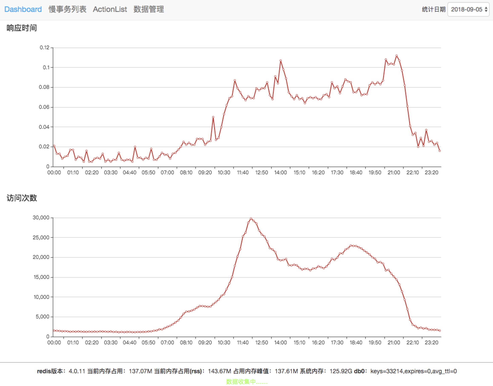
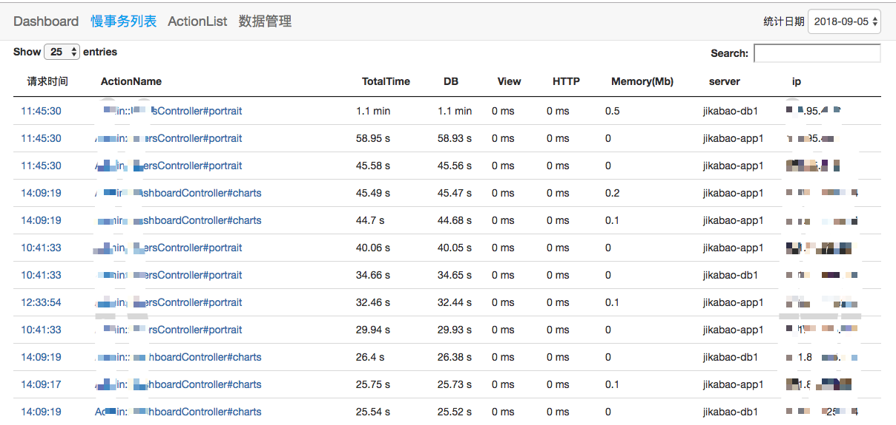
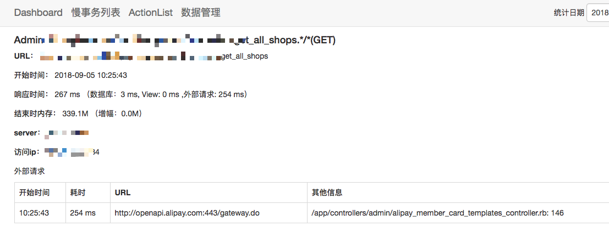
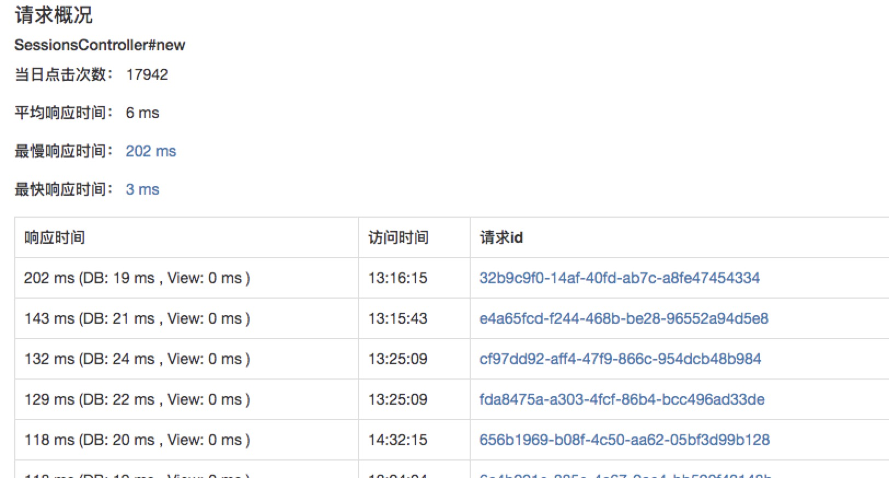

# SimpleApm (Rails Engine)
基于Redis的简单的Web请求性能监控/慢事务追踪工具

以天为维度记录：
- 最慢的500个(默认500)请求
- 记录每个action最慢的20次请求
- 记录每个action的平均访问时间
- 记录慢请求的详情和对应SQL详情（多余的会删掉）
- 以10分钟为刻度记录平均/最慢访问时间、次数等性能指标，并生成图表
- 记录请求中外部http访问时间


## 原理

围绕Rack记录请求级别的相关信息，使用redis作为数据存储/计算工具来记录慢事务

数据传递核心为：[Active Support Instrumentation](https://guides.rubyonrails.org/active_support_instrumentation.html)

处理Instrument方式为开启一个不影响主线程的常驻线程，循环计算处理数据

获取内存信息用到了gem: [get_process_mem](https://github.com/schneems/get_process_mem)，经测试在linux系统耗时在1ms以下


## 功能截图
- Dashboard


- 慢请求列表


- Action列表


- 请求详情


- Action概况


- 数据管理


## Usage

```ruby
# routes.rb
mount SimpleApm::Engine => "/apm"

# 或运行 
rails generate simple_apm:install 

```


## Installation
Add this line to your application's Gemfile:

```ruby
gem 'simple_apm'
```

And then execute:
```bash
$ bundle
```


## Contributing
Contribution directions go here.

## License
The gem is available as open source under the terms of the [MIT License](http://opensource.org/licenses/MIT).
